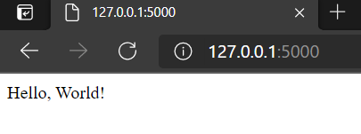

# First Encounter with Flask

### Requirements

The Python package is called `Flask`. You can either:
- Install manually with: `pip install Flask`
- Declare `Flask~=2.0.0` in the `requirements.txt` and run
  `pip install -r requirements.txt`

---

## Running with the Flask Command

Python Flask comes with a `flask` command which facilitates running your
application directly from the command line. This command is what most _'getting
started with Flask'_ tutorials/documentations will start with. To use it, start
with a simple python script such as this:

```python
from flask import Flask

app = Flask(__name__)


@app.route("/")
def hello():
  return "Hello, World!"
```

Fire off `flask run` in your preferred terminal, navigate to
[http://127.0.0.1:5000/](http://127.0.0.1:5000/), and you should see a basic
html page with the industry standard greeting:



_([See the code changes in this step on Github][step1.0])_

---

## Running with the Python Command

Using the 1`flask` command is nice but there are also use cases for running the
app via the usual `python <script_name>` command. For this to work, you will
have to modify the script to build the app a bit differently and call the
`<flask_obj>.run()` method from within the script:

```python
from typing import NoReturn

from flask import Flask


def _main() -> NoReturn:
    flask_app = Flask(__name__)

    @flask_app.route("/")
    def hello():
        return "Hello, World!"

    flask_app.run()
    exit()


if __name__ == '__main__':
    _main()
```

This time, run `python app.py` in your preferred terminal, navigate to
[http://127.0.0.1:5000/](http://127.0.0.1:5000/), and you'll see that same
html greeting from before.


_([See the code changes in this step on Github][step1.1])_

---

## Supporting both the Flask and Python Commands

A bit of cleanup and extraction will allow running the Flask server with either
approach:

```python
from typing import NoReturn

from flask import Flask


def _construct_flask_app() -> Flask:
    flask_app = Flask(__name__)

    @flask_app.route("/")
    def hello():
        return "Hello, World!"

    return flask_app


def _main() -> NoReturn:
    flask_app = _construct_flask_app()

    flask_app.run()
    exit()


if __name__ == '__main__':
    _main()
else:
    app = _construct_flask_app()
```

This approach separates the app construction from the running of it. When
running with the `python app.py` command the `_main()` method will be called
which subsequently calls `flask_app.run()`. When running with the `flask run`
command the app is constructed and stored in the `app` variable which is
subsequently discovered and run by internal Flask logic.

_([See the code changes in this step on Github][step1.2])_

---

## Additional Setup And Comments

- The location/name of the main `app.py` files matters for the `flask` command.
  By default, doing a `flask run` will look for either `wsgi.py` or `app.py` in
  the run directory. To override this, set the value of the `FLASK_APP`
  environment variable to match the script path _(relative or absolute)_.
- To change te environment type, the `FLASK_ENV` environment variable can be set
  to either production or development. Doing the latter addresses the warnings.
- Setting the port must be done differently depending on which approach is used.
  - For the `flask` command, do: `flask run -h <host> -p <port>`
  - For the `python` command, modify the run params as follows:
    `<app>.run(host=<host>, port=<port>)`

---

[__Back To Home__][home]

[home]: ../README.md

[step1.0]: https://github.com/kirypto/LightningPythonFlask/compare/step0...step1.0

[step1.1]: https://github.com/kirypto/LightningPythonFlask/compare/step1.0...step1.1

[step1.2]: https://github.com/kirypto/LightningPythonFlask/compare/step1.1...step1.2
