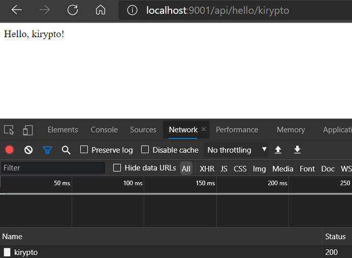
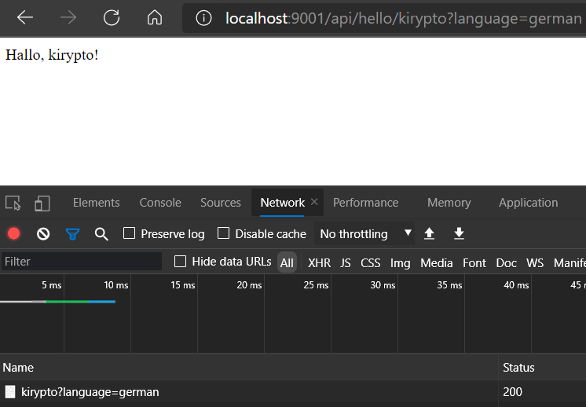
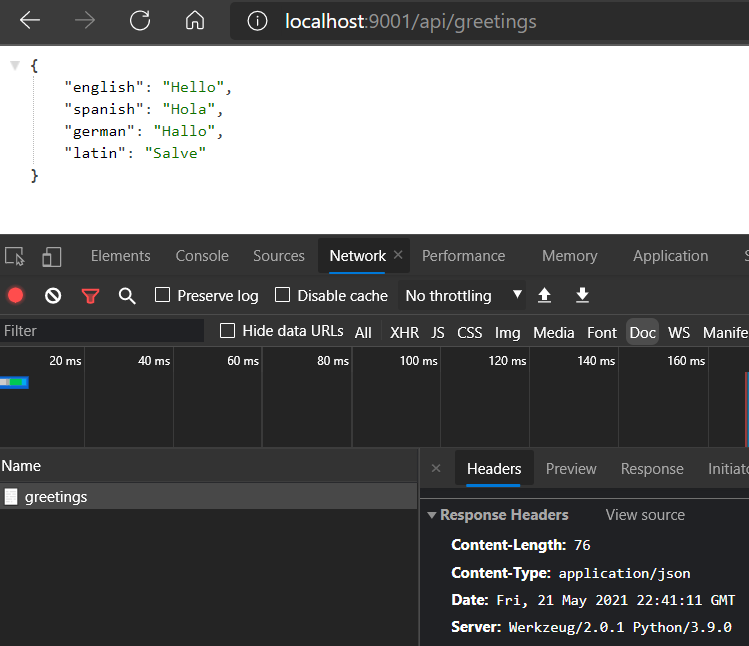
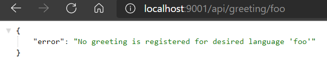

# First GET Request Handler

## Setup

To ease running the application from here on, the following changes have been
made:
- The main python application is now named `flask_app.py` and is located in
  `<projectRoot>/Source/Python`
- A PowerShell script exists to activate the venv, set up the environment vars,
  and run the app. It should be run from the project root as follows:
  `./Scripts/runApp.ps1`
- If running with python, use `python Source/Python/flask_app.py`
- The host has been changed to `0.0.0.0` to allow hitting `localhost` or the
  machine name, and the port has changed to `9001`
- The `flask_app.py` script now calls off to a new `api.py` module to register
  handler routes with flask

_([See the code changes in this step on Github][step2.0])_

---

## Registering a GET handler for a specific route

There is very little to this step, in fact technically there is already a
GET handler for returning 'Hello, World!' when hitting the application root.
For this step, the primary difference is the use of Flask's `make_request`
method. The GET method type is also being explicitly being set instead of
relying on the default:

```python
# api.py
from flask import Flask, make_response


def register_endpoints(flask_app: Flask) -> None:
    @flask_app.route("/api/hello", methods=["GET"])
    def api_hello__get():
        return make_response("Hello, Flask API!", 200)
```

_([See the code changes in this step on Github][step2.1])_

---

## Making use of path parameters

Tying in path parameters to Flask is trivial, simply wrap the variable in angle
brackets _(`<` and `>`)_ when defining the path. Modifying the existing route
so that it accepts a name as a parameter allows us to tailor the greeting to
any name provided:

__Note: The identifier within the angle brackets must match the parameter in
the following method!__
```python
# api.py
from flask import Flask, make_response


def register_endpoints(flask_app: Flask) -> None:
    @flask_app.route("/api/hello/<name>", methods=["GET"])
    def api_hello_name__get(name: str):
        return make_response(f"Hello, {name}!", 200)
```

Now, hitting the route in the browser with a name returns the desired greeting:


_([See the code changes in this step on Github][step2.2])_

---

## Making use of query parameters

Python Flask provides access to query parameters via the `flask.request` object
which can be imported. When a handler method is called, the `request` object
will already be populated with information from the request such as headers,
query params, etc.  Query parameters are stored in the `request.args` dictionary
field.

For this example, a query param `language` is checked for and used to modify the
greeting similar to the name path param. Note that the query param is optional
and defaults to 'english':

```python
# api.py
from flask import Flask, make_response, request


def register_endpoints(flask_app: Flask) -> None:
    @flask_app.route("/api/hello/<name>", methods=["GET"])
    def api_hello_name__get(name: str):
        language = request.args.get("language", type=str) if "language" in request.args else "english"
        greeting = _get_greeting_in(language)
        return make_response(f"{greeting}, {name}!", 200)


def _get_greeting_in(language: str) -> str:
    greetings_by_language = {
        "english": "Hello",
        "spanish": "Hola",
        "german": "Hallo",
        "latin": "Salve",
    }
    if language not in greetings_by_language:
        raise ValueError(f"No greeting is registered for desired language '{language}'")
    return greetings_by_language[language]
```

This time, hit the route in the browser with name as well as a language _(only
choose one of the languages listed above or there will be an exception)_:



_([See the code changes in this step on Github][step2.3])_

---

## Responding with an `application/json` response and appropriate status code

To demonstrate setting the response's Content-Type and status code, two new
handlers have been introduced: one that allows retrieving all greetings
available as a json dictionary and one that allows retrieving the greeting
for a specific language.

The status code is changed simply by changing the int passed to `make_response`.
The Content-Type header is changed by modifying the `content_type` on the
response object before returning it.

```python
# api.py
from json import dumps

from flask import Flask, make_response, request

_GREETINGS_BY_LANGUAGE = {
    "english": "Hello",
    "spanish": "Hola",
    "german": "Hallo",
    "latin": "Salve",
}


def register_endpoints(flask_app: Flask) -> None:
    @flask_app.route("/api/hello/<name>", methods=["GET"])
    def api_hello_name__get(name: str):
        language = request.args.get("language", type=str) if "language" in request.args else "english"
        greeting = _get_greeting_in(language)
        return make_response(f"{greeting}, {name}!", 200)

    @flask_app.route("/api/greetings", methods=["GET"])
    def api_greetings__get():
        response = make_response(dumps(_GREETINGS_BY_LANGUAGE), 200)
        response.content_type = "application/json"
        return response

    @flask_app.route("/api/greeting/<language>", methods=["GET"])
    def api_greeting_language__get(language: str):
        try:
            greeting = _get_greeting_in(language)
            response = make_response(greeting, 200)
        except ValueError as e:
            response = make_response(dumps({"error": str(e)}), 404)
        response.content_type = "application/json"
        return response


def _get_greeting_in(language: str) -> str:
    if language not in _GREETINGS_BY_LANGUAGE:
        raise ValueError(f"No greeting is registered for desired language '{language}'")
    return _GREETINGS_BY_LANGUAGE[language]
```

With these new routes; the stored greeting for each language can be returned as
a json string, and the dictionary of all greetings can be retrieved as a json
dictionary.



Additionally, if an attempt is made to retrieve a greeting for a language that
does not exist, a json response is returned with the error message.



_([See the code changes in this step on Github][step2.4])_

---

[__Back To Home__][home]

[home]: ../README.md

[step2.0]: https://github.com/kirypto/LightningPythonFlask/compare/step1.2...step2.0

[step2.1]: https://github.com/kirypto/LightningPythonFlask/compare/step2.0...step2.1

[step2.2]: https://github.com/kirypto/LightningPythonFlask/compare/step2.1...step2.2

[step2.3]: https://github.com/kirypto/LightningPythonFlask/compare/step2.2...step2.3

[step2.4]: https://github.com/kirypto/LightningPythonFlask/compare/step2.3...step2.4
