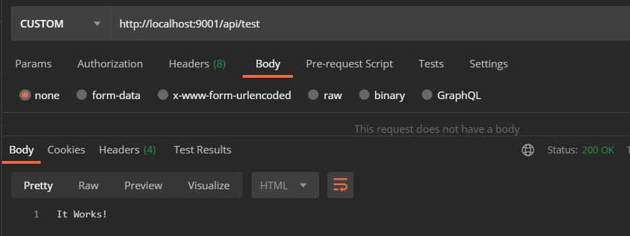

# Handling Other Request Types

## Specifying Route Method Types

With Python Flask, the handler method types are configured by providing a string
array as the `methods` argument of the `<flask_app>.route`. The default for this
parameter is `["GET"]` allowing it to be skipped for any GET-only handler, but
it can be explicitly provided as demonstrated in previous steps.

The flexibility of the string method types allows registering any known method
types and even custom methods, although that diverges from the
[HTTP/1.1 spec][rfc7231]. For example:

```python
from flask import Flask, make_response

flask_app = Flask(__name__)  # This is only a sample

@flask_app.route("/api/test", methods=["CUSTOM"])
def test():
    return make_response("It Works!", 200)
```

Then, hitting the route with Postman and specifying `CUSTOM` for the type
results in the expected response:



---

## Interacting with the Body parameter

The majority of non-GET requests provide contents via the request body. The
body content can be retrieved from the `request.data` property similar to the
`request.args` seen previously.

Making use of the body argument in a PUT handler, add a route to allow upserting
greetings by language:

```python
from json import dumps

from flask import Flask, make_response, request

_GREETINGS_BY_LANGUAGE = {
    "english": "Hello",
    "spanish": "Hola",
    "german": "Hallo",
    "latin": "Salve",
}


def register_endpoints(flask_app: Flask) -> None:
    @flask_app.route("/api/hello/<name>", methods=["GET"])
    def api_hello_name__get(name: str):
        language = (request.args.get("language", type=str)
                    if "language" in request.args else "english")
        greeting = _get_greeting_in(language)
        return make_response(f"{greeting}, {name}!", 200)

    @flask_app.route("/api/greetings", methods=["GET"])
    def api_greetings__get():
        response = make_response(dumps(_GREETINGS_BY_LANGUAGE), 200)
        response.content_type = "application/json"
        return response

    @flask_app.route("/api/greeting/<language>", methods=["GET"])
    def api_greeting_language__get(language: str):
        try:
            greeting = _get_greeting_in(language)
            response = make_response(greeting, 200)
        except ValueError as e:
            response = make_response(dumps({"error": str(e)}), 404)
        response.content_type = "application/json"
        return response

    # NEW
    @flask_app.route("/api/greeting/<language>", methods=["PUT"])
    def api_greeting_language__put(language: str):
        is_new_greeting = language in _GREETINGS_BY_LANGUAGE
        greeting = request.data.decode("utf8")
        _GREETINGS_BY_LANGUAGE[language] = greeting
        response = make_response(
            f"Set greeting for {language} to be '{greeting}'",
            201 if is_new_greeting else 200)
        response.content_type = "application/json"
        return response


def _get_greeting_in(language: str) -> str:
    if language not in _GREETINGS_BY_LANGUAGE:
        raise ValueError(
            f"No greeting is registered for desired language '{language}'")
    return _GREETINGS_BY_LANGUAGE[language]
```

_([See the code changes in this step on Github][step3.0])_

---

## Quality of Life Improvements with Json Content

In addition to the `request.data` property, Flask provides a `request.json`
property which automatically parses the body contents into a Python object.
This may end up being a `list`, `dict`, any primitive, or combinations of them.
This can be very useful for accepting and dealing with more complex data.

_Note: the `request.json` property is only populated if the request's
`Content-Type` header is `application/json`_

```python
from json import dumps

from flask import Flask, make_response, request

_GREETINGS_BY_LANGUAGE = {
    "english": "Hello",
    "spanish": "Hola",
    "german": "Hallo",
    "latin": "Salve",
}


def register_endpoints(flask_app: Flask) -> None:
    @flask_app.route("/api/hello/<name>", methods=["GET"])
    def api_hello_name__get(name: str):
        language = (request.args.get("language", type=str)
                    if "language" in request.args else "english")
        greeting = _get_greeting_in(language)
        return make_response(f"{greeting}, {name}!", 200)

    @flask_app.route("/api/greetings", methods=["GET"])
    def api_greetings__get():
        response = make_response(dumps(_GREETINGS_BY_LANGUAGE), 200)
        response.content_type = "application/json"
        return response

    # NEW
    @flask_app.route("/api/greetings", methods=["PUT"])
    def api_greetings__put():
        return make_response(dumps(request.mimetype), 200)
        greetings: dict = request.json
        if type(greetings) is not dict or \
                any(map(lambda x: type(x) is not str,
                        list(greetings.keys()) + list(greetings.values()))):
            raise ValueError("Body contents must be a dictionary of strings")
        _GREETINGS_BY_LANGUAGE.clear()
        _GREETINGS_BY_LANGUAGE.update(greetings)
        response = make_response(dumps(_GREETINGS_BY_LANGUAGE), 200)
        response.content_type = "application/json"
        return response

    @flask_app.route("/api/greeting/<language>", methods=["GET"])
    def api_greeting_language__get(language: str):
        try:
            greeting = _get_greeting_in(language)
            response = make_response(greeting, 200)
        except ValueError as e:
            response = make_response(dumps({"error": str(e)}), 404)
        response.content_type = "application/json"
        return response

    @flask_app.route("/api/greeting/<language>", methods=["PUT"])
    def api_greeting_language__put(language: str):
        is_new_greeting = language in _GREETINGS_BY_LANGUAGE
        greeting = request.data.decode("utf8")
        _GREETINGS_BY_LANGUAGE[language] = greeting
        response = make_response(
            f"Set greeting for {language} to be '{greeting}'",
            201 if is_new_greeting else 200)
        response.content_type = "application/json"
        return response


def _get_greeting_in(language: str) -> str:
    if language not in _GREETINGS_BY_LANGUAGE:
        raise ValueError(
            f"No greeting is registered for desired language '{language}'")
    return _GREETINGS_BY_LANGUAGE[language]
```

_([See the code changes in this step on Github][step3.1])_

---

[__Back To Home__][home]

[home]: ../README.md

[rfc7231]: https://datatracker.ietf.org/doc/html/rfc7231

[step3.0]: https://github.com/kirypto/LightningPythonFlask/compare/step2.4...step3.0

[step3.1]: https://github.com/kirypto/LightningPythonFlask/compare/step3.0...step3.1
