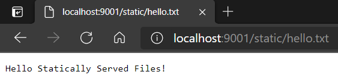

# Getting Fancy

## Multi Method Type Request Handlers

It can be useful to handle multiple method types with a single handler, such as
when the body is to be parsed in the same way, or the same content type will be
returned. In these cases, a single handler method can be registered for each by
specifying the list of applicable types in the `methods` argument. Inside the
handler, method dependent logic can be isolated by making use of the
`request.method` property.

With this approach, 4 routes _(`/api/greetings` and `/api/greeting/<language>)_
can be combined into two:

```python
# api.py
from json import dumps

from flask import Flask, make_response, request

_GREETINGS_BY_LANGUAGE = {
    "english": "Hello",
    "spanish": "Hola",
    "german": "Hallo",
    "latin": "Salve",
}


def register_endpoints(flask_app: Flask) -> None:
    @flask_app.route("/api/hello/<name>", methods=["GET"])
    def api_hello_name__get(name: str):
        language = (request.args.get("language", type=str)
                    if "language" in request.args else "english")
        greeting = _GREETINGS_BY_LANGUAGE[language]
        return make_response(f"{greeting}, {name}!", 200)

    @flask_app.route("/api/greetings", methods=["GET", "PUT"])
    def api_greetings():
        if request.method == "GET":
            response = make_response(dumps(_GREETINGS_BY_LANGUAGE), 200)
        else:
            greetings: dict = request.json
            if type(greetings) is not dict or any(map(
                    lambda x: type(x) is not str,
                    list(greetings.keys()) + list(greetings.values()))):
                raise ValueError("Body contents must be a dictionary of strings")
            _GREETINGS_BY_LANGUAGE.clear()
            _GREETINGS_BY_LANGUAGE.update(greetings)
            response = make_response(dumps(_GREETINGS_BY_LANGUAGE), 200)
        response.content_type = "application/json"
        return response

    @flask_app.route("/api/greeting/<language>", methods=["GET", "PUT"])
    def api_greeting_language(language: str):
        if request.method == "GET":
            greeting = _GREETINGS_BY_LANGUAGE[language]
            response = make_response(greeting, 200)
        else:
            is_new_greeting = language in _GREETINGS_BY_LANGUAGE
            greeting = request.data.decode("utf8")
            _GREETINGS_BY_LANGUAGE[language] = greeting
            response = make_response(
                f"Set greeting for {language} to be '{greeting}'",
                201 if is_new_greeting else 200)
        response.content_type = "application/json"
        return response
```

_Note: In this step, logic was also removed that returned a well formatted 404
when a non-existent language was specified. This was removed because a cleaner
solution will be demonstrated in the following Exception Handling section._

_([See the code changes in this step on Github][step4.0])_

---

## Exception Handling

By default, when exceptions are thrown in the application, Flask allows them to
bubble out and generates and HTML page with the exception and stack trace.
Although this works well in many cases, control of the returned response is
often desired.

In this example, an annotation function is used to define one standardized way
of handling exceptions and returns a json response accordingly. This annotation
function can then be reused on all the existing route definitons:

```python
# api.py
from json import dumps
from typing import Callable, Union

from flask import Flask, make_response, request
from werkzeug.exceptions import BadRequest

_GREETINGS_BY_LANGUAGE = {
    "english": "Hello",
    "spanish": "Hola",
    "german": "Hallo",
    "latin": "Salve",
}


def register_endpoints(flask_app: Flask) -> None:
    @flask_app.route("/api/hello/<name>", methods=["GET"])
    @with_error_response_on_raised_exceptions
    def api_hello_name__get(name: str):
        language = (request.args.get("language", type=str)
                    if "language" in request.args else "english")
        greeting = _GREETINGS_BY_LANGUAGE[language]
        return make_response(f"{greeting}, {name}!", 200)

    @flask_app.route("/api/greetings", methods=["GET", "PUT"])
    @with_error_response_on_raised_exceptions
    def api_greetings():
        if request.method == "GET":
            response = make_response(dumps(_GREETINGS_BY_LANGUAGE), 200)
        else:
            greetings: dict = request.json
            if type(greetings) is not dict or any(map(
                    lambda x: type(x) is not str,
                    list(greetings.keys()) + list(greetings.values()))):
                raise ValueError("Body contents must be a dictionary of strings")
            _GREETINGS_BY_LANGUAGE.clear()
            _GREETINGS_BY_LANGUAGE.update(greetings)
            response = make_response(dumps(_GREETINGS_BY_LANGUAGE), 200)
        response.content_type = "application/json"
        return response

    @flask_app.route("/api/greeting/<language>", methods=["GET", "PUT"])
    @with_error_response_on_raised_exceptions
    def api_greeting_language(language: str):
        if request.method == "GET":
            greeting = _GREETINGS_BY_LANGUAGE[language]
            response = make_response(greeting, 200)
        else:
            is_new_greeting = language in _GREETINGS_BY_LANGUAGE
            greeting = request.data.decode("utf8")
            _GREETINGS_BY_LANGUAGE[language] = greeting
            response = make_response(
                f"Set greeting for {language} to be '{greeting}'",
                201 if is_new_greeting else 200)
        response.content_type = "application/json"
        return response


def _error_response(ex: Union[BaseException, str], status_code: int):
    error_message = ex if type(ex) is str else f"{type(ex).__name__}: {ex}"
    response = make_response(dumps({"error": error_message, "status_code": status_code}), status_code)
    response.content_type = "application/json"
    return response


def with_error_response_on_raised_exceptions(handler_function: Callable) -> Callable:
    def inner(*args, **kwargs):
        try:
            return handler_function(*args, **kwargs)
        except (TypeError, ValueError, AttributeError) as e:
            return _error_response(e, 400)
        except BadRequest as e:
            return _error_response(str(e), 400)
        except KeyError as e:
            return _error_response(e, 404)
        except BaseException as e:
            return _error_response(e, 500)

    inner.__name__ = f"__wrapped__{handler_function.__name__}"  # Flask needs method names to be unique
    return inner
```

_([See the code changes in this step on Github][step4.1])_

---

## Serving Static Files

Python Flask makes serving static files trivial. In the construction of the
`Flask` object, two arguments can be provided:
- `static_url_path` Allows configuring the url prefix for accessing static
  files. Setting this to `static` would mean a file called `hello.txt` would
  be accessible at `<host/port>/static/hello.txt`.
- `static_folder` Provides flask the file path to a folder containing any files
  to statically serve. Continuing the example above, this would be the folder
  containing the `hello.txt` file.

```python
# flask_app.py
from pathlib import Path
from typing import NoReturn

from flask import Flask

from Source.Python.api import register_endpoints


def _construct_flask_app() -> Flask:
    static_file_folder = Path(__file__).parents[1].joinpath("Resource/StaticFiles").as_posix()
    flask_app = Flask(__name__, static_url_path="/static", static_folder=static_file_folder)

    @flask_app.route("/")
    def hello():
        return "Hello, World!"

    register_endpoints(flask_app)

    return flask_app


def _main() -> NoReturn:
    flask_app = _construct_flask_app()

    flask_app.run(host="0.0.0.0", port=9001)
    exit()


if __name__ == '__main__':
    _main()
else:
    app = _construct_flask_app()

```

Aside from providing the arguments, add a file to the created static folder with
some text and navigate to `<host/port>/static/<filename>`. The contents of the
text should be served:



_([See the code changes in this step on Github][step4.2])_

---

[__Back To Home__][home]

[home]: ../README.md

[step4.0]: https://github.com/kirypto/LightningPythonFlask/compare/step3.1...step4.0

[step4.1]: https://github.com/kirypto/LightningPythonFlask/compare/step4.0...step4.1

[step4.2]: https://github.com/kirypto/LightningPythonFlask/compare/step4.1...step4.2
